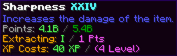

# Enchantment Library Standalone

This mod is a standalone, feature-expanded version of the Enchantment Library block originally from the
[Apothic Enchanting](https://www.curseforge.com/minecraft/mc-mods/apothic-enchanting?raw=true) mod by
[Shadows_of_Fire](https://www.curseforge.com/members/shadows_of_fire/projects).

---

# Mechanics

The Enchantment Library is your ultimate long-term storage solution for magic. Say goodbye to chests overflowing with
mismatched enchanted books. The Library converts enchantments into raw "points" stored directly within the block,
allowing you to seamlessly reconstruct exactly the book you need, at the exact level you want.

### Adding Enchantments

- **Insertion:** Simply place any Enchanted Book into the input slot. The library will consume the book, break down the
  enchantments into raw mathematical points, and add them to your pool.
- **The Disenchant Mechanic:** Have old, unused, or looted enchanted armor and tools? Place them in the `FILTER` slot
  and click the **Disenchant Button**. The library will utterly destroy the item, siphoning its magical essence and
  adding the enchantments directly into the block's point storage.

### Extracting & Refunding

You can extract stored enchantments onto an output book or refund them back into the library using the following unified
controls:

- `Left-Click`: Extracts exactly **1 level** of the enchantment.
- `Shift + Left-Click`: Extracts the **maximum possible level** of the enchantment based on your available points and
  library Tier.
- `Ctrl + Left-Click`: **Refunds 1 level** of the enchantment from your output book back into the library.
- `Ctrl + Shift + Left-Click`: **Refunds the entire enchantment** from your output book back into the library.
- **Return Button:** Instantly refunds all enchantments present on the output book back into the library's storage.

---

### The Dynamic XP Cost System

Extracting pure magic from the library isn't completely free; it requires player Experience Points.

To maintain late-game balance, the required XP amount scales _quadratically_ based on the enchantment level you are
actively extracting:

> `XpCost = baseMultiplier * (enchlevel * enchlevel)`

- **Level 1** cost: `40 XP Points` (~4 Levels)
- **Level 10** cost: `400 XP Points` (~17 Levels)
- **Level 30** cost: `36,000 XP Points` (~106 Levels)

**Refunds:** If you refund a book back into the library using `Ctrl`, the exact XP cost originally required for those
enchantments is refunded directly back to you. No lost XP.

---

### Advanced Tooltips

Hovering over any stored enchantment in the library reveals a detailed tooltip that gives you useful information at a
glance.

**What you can see:**

1. **Max Learned Level:** The highest level of this enchantment the library has currently recorded.
2. **Description:** The explanation of the enchantment (Requires the
   [Enchantment Descriptions](https://www.curseforge.com/minecraft/mc-mods/enchantment-descriptions) mod by
   [DarkhaxDev](https://www.curseforge.com/members/darkhaxdev/projects)).
3. **Stored vs. Max Points:** Your current magical point bank versus the Tier's cap.
4. **Resulting Level:** What level the book will _actually_ have if you follow through with the current click
   interaction.
5. **Point & XP Cost:** The exact transaction costs.

---

## Library Tiers & Capacities

The Enchantment Library operates on a three-tier system. Higher tiers are significantly harder to craft but vastly
expand both your storage capacity and the maximum level of enchantment you are allowed to reconstruct.

### Tier 1: Default Max Level V (5)

### Tier 2: Default Max Level X (10)

### Tier 3: Default Max Level XXX (30)

---

## Configuration Options

The Enchantment Library Standalone is quite customizable especially for modpack creators. You can edit these values in
the config file or via UI using a mod like [Configured](https://www.curseforge.com/minecraft/mc-mods/configured) by
[MrCrayfish](https://www.curseforge.com/members/mrcrayfish/projects).

| Setting                       | Default                        | What It Does (The Why)                                                                                                                     |
| ----------------------------- | ------------------------------ | ------------------------------------------------------------------------------------------------------------------------------------------ |
| **Require Xp For Extraction** | `true`                         | Toggles the entire Experience Cost mechanic.                                                                                               |
| **Base Xp Multiplier**        | `40`                           | The core multiplier used in the quadratic XP cost formula (`baseMultiplier * level^2`). Lower this to make high-level extractions cheaper. |
| **Enable Disenchant Button**  | `true`                         | Toggles the functionality of the GUI Disenchant feature.                                                                                   |
| **Keep Inventory**            | `true`                         | If true, breaking the block retains all stored enchantment points inside the dropped item's data components.                               |
| **Require Silk Touch**        | `false`                        | If true, you must use a Silk Touch tool to successfully trigger `Keep Inventory`. Otherwise, all stored enchantments are lost upon break.  |
| **Enchantment Blacklist**     | _(Empty)_                      | A list of enchantments (e.g., `minecraft:mending`) that the library will completely refuse to store.                                       |
| **Tier 1 Max Level**          | `5`                            | The maximum enchantment level you can extract from a Tier 1 Library.                                                                       |
| **Tier 2 Max Level**          | `10`                           | The maximum enchantment level you can extract from a Tier 2 Library.                                                                       |
| **Tier 3 Max Level**          | `30`                           | The maximum enchantment level you can extract from a Tier 3 Library.                                                                       |
| **Tier 1 Max Points**         | `160` (10 max books)           | The maximum point capacity for a single enchantment type in Tier 1.                                                                        |
| **Tier 2 Max Points**         | `5,120` (10 max books)         | The maximum point capacity for a single enchantment type in Tier 2.                                                                        |
| **Tier 3 Max Points**         | `5,368,709,120` (10 max books) | The maximum point capacity for a single enchantment type in Tier 3.                                                                        |

---

## Frequently Asked Questions (FAQ)

**Q: Is Apothic Enchanting required to run this mod?**  
A: No. This is a standalone mod and does not require Apothic Enchanting or any other mods.

**Q: Can I store modded enchantments?**  
A: Yes! Modded enchantments are fully supported unless blacklisted in the config.

**Q: Does breaking the block destroy all my stored enchantments?**  
A: No. Unless `Keep Inventory` is disabled in the configs.

**Q: Will the Disenchant button give me my original item back?**  
A: No. Disenchanting destroys the item in the process.

---

## Modpacks

You are completely free to use this mod in any modpack. Enjoy!
