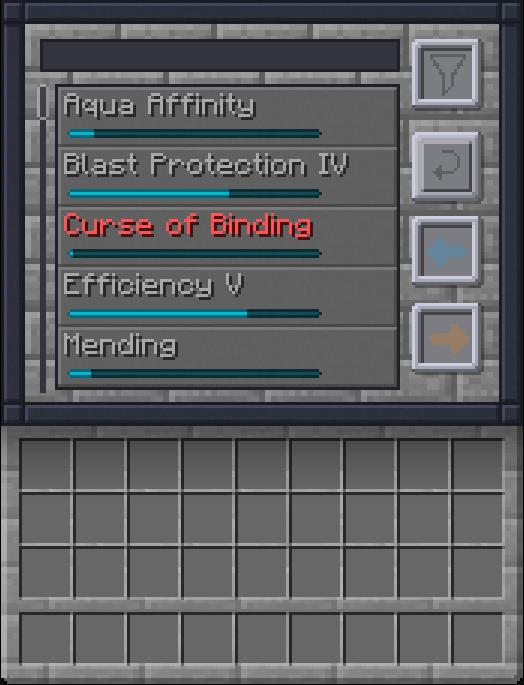
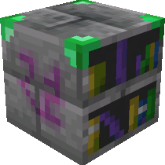
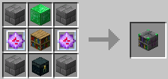
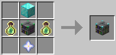
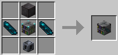

# Enchantment Library (Standalone)

This mod is a standalone version of the Enchantment Library feature from the
[Apothic Enchanting](https://www.curseforge.com/minecraft/mc-mods/apothic-enchanting?raw=true) mod, with additional
features.

## Core Mechanics

The Enchantment Library is a block that stores enchantments from enchanted books and allows you to extract them later.

- **Insertion:** Insert enchanted books into the Library's input slot. The enchantments on the book are converted into
  points and stored inside the block. The original book is consumed.
- **Browsing:** In the Library GUI there is a list of all stored enchantments and their available point values.
- **Extraction and Refunds:** You can extract enchantments into an output book, or refund them back to the library over
  the GUI:
  - `Left-Click`: Extracts 1 level of the enchantment.
  - `Shift + Left-Click`: Extracts the maximum possible level of the enchantment.
  - `Ctrl + Left-Click`: Refunds 1 level of the enchantment from the output book back into the library.
  - `Ctrl + Shift + Left-Click`: Refunds the entire enchantment from the output book back into the library.
  - **Return Button:** Click the return button in the GUI to refund all enchantments currently on the output book back
    into the library.

Experience levels are consumed or refunded symmetrically during extraction, based on the vanilla costs required to reach
the target enchantment level.

## Tiers

The Enchantment Library has three tiers. Higher tiers allow you to reconstruct enchantments at higher levels:

### Library Tier 1: **Level V (5)**

### Library Tier 2: **Level X (10)**

### Library Tier 3: **Level XXX (30)**

## FAQ

**Q: Is Apothic Enchanting required to run this mod?**  
A: No. This is a entirely standalone mod and does not require Apothic Enchanting.

**Q: Can I store modded enchantments?**  
A: Yes. Any valid enchanted book from any mod can be inserted into the library.

**Q: Why does the tooltip say "Extraction Unavailable"?**  
A: This message appears if you do not have enough stored points for that specific enchantment.

**Q: Does breaking the block destroy the stored enchantments?**  
A: No. The stored points are saved in the block's data. If you break the library, it will keep its inventory, and you
will not lose your stored enchantments.

## Modpacks

You can use this mod in any modpack.
